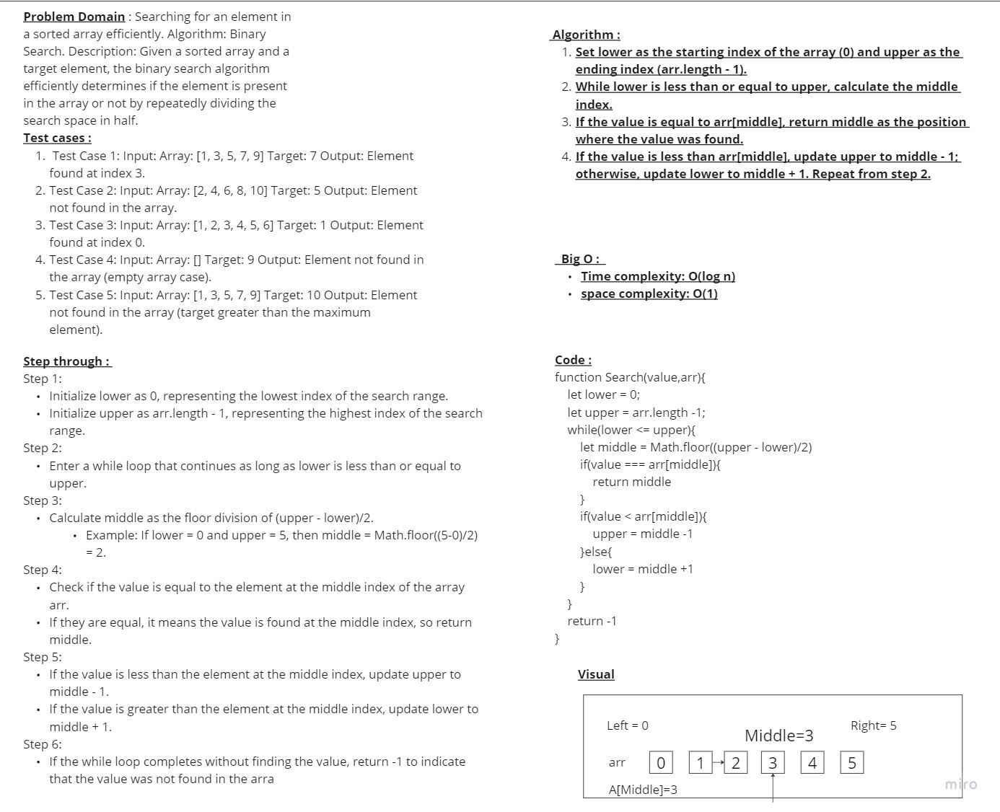

 # BinarySearch 
 a function BinarySearch which takes in 2 parameters and a sorted array and the search key.

## Whiteboard Process

## Approach & Efficiency

### Approach:

- Initialize lower and upper as the starting and ending indices of the array, respectively.
- While lower is less than or equal to upper, calculate the middle index.
- If the target value is found at arr[middle], return middle.
- If the target value is less than arr[middle], update upper to middle - 1; otherwise, update lower to middle + 1. Repeat from step 2.
#### This approach describes the core steps of the binary search algorithm in a concise manner, providing a clear overview of the key operations involved.

### Efficiency:
- Binary search is an efficient algorithm for searching in sorted arrays.
- It has a time complexity of O(log n), where n represents the size of the array.
- This logarithmic time complexity allows binary search to quickly locate the target element.
- Binary search repeatedly divides the search range in half, eliminating half of the remaining elements at each step, leading to efficient searching.

### Time complexity:

#### Binary search has a time complexity of O(log n).
#### The logarithmic time complexity arises from the fact that the search range is halved at each step.
#### It efficiently narrows down the search range to a single element in a sorted array.
#### As the input size (n) grows, the number of operations required grows logarithmically, resulting in efficient searching.
#### Binary search exhibits sub-linear time complexity, making it highly efficient for large input sizes.

### Space Complexity:

#### Binary search has a space complexity of O(1).
#### It uses a constant amount of additional space, regardless of the input size.
#### The space usage remains the same throughout the execution of the algorithm.
#### It does not require any significant memory allocation or additional data structures.
#### Binary search achieves its efficiency by manipulating the indices of the original array, without requiring additional space.

## Solution : 

function Search(value,arr){
    let lower = 0;
    let upper = arr.length -1;
    while(lower <= upper){
        let middle = Math.floor((upper - lower)/2)
        if(value === arr[middle]){
            return middle
        }
        if(value < arr[middle]){
            upper = middle -1
        }else{
            lower = middle +1
        }
    }
    return -1
}