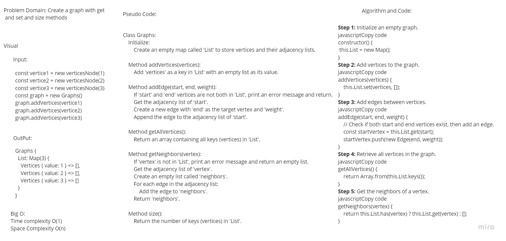
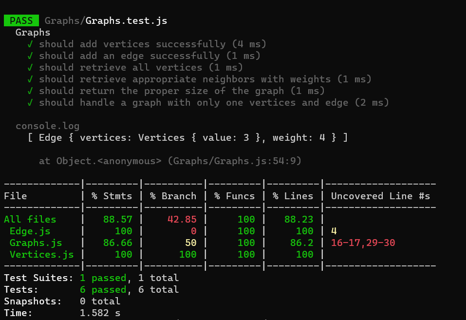

# Graphs Implementation

## Pull Request:

## whiteBoard:


## Unit Test : 


## Big O:
### Time Complexity: O(1) 

### Space Complexity: O(n) 

### Approach
Initialize a map to store vertices and their adjacency lists.
Add vertices to the graph and create edges between them.
Retrieve information about the graph, including its vertices and their neighbors.

### Code
```javascript
'use strict'

const verticesNode = require('./Vertices')
const Edge = require('./Edge')
class Graphs {
    constructor() {
        this.List = new Map();
    }

    addVertices(vertices) {
        this.List.set(vertices, [])
        return
    }
    addEdge(start, end, weight) {
        if (!this.List.has(start) && !this.List.has(end)) {
            console.log('cant add edge to none or one vertices only')
            return;
        }
        const startVertex = this.List.get(start);
        const edge = new Edge(end, weight);
        startVertex.push(edge);
    }
    getAllVertices() {
        return Array.from(this.List.keys());
    }

    getNeighbors(vertex) {
        if (!this.List.has(vertex)) {
            console.log('Vertex not found');
            return [];
        }

        const neighbors = this.List.get(vertex).map((edge) => edge);

        return neighbors;
    }

    size() {
        return this.List.size
    }

}