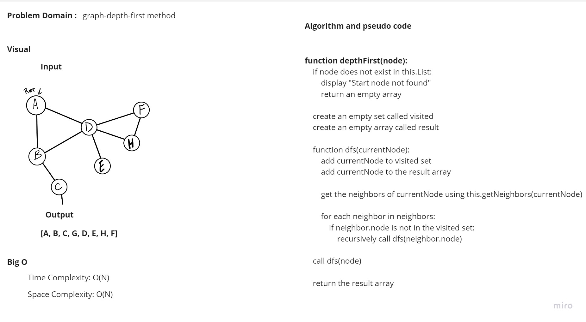
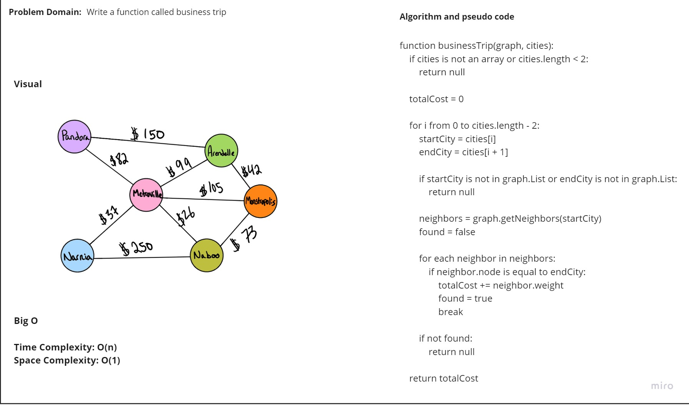
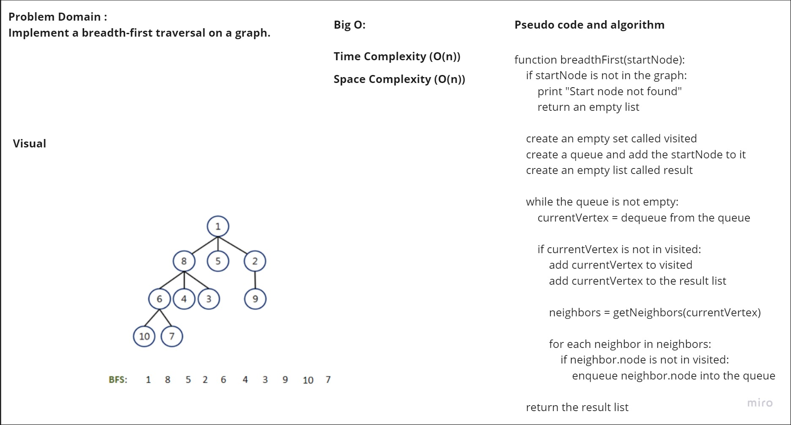

# Graphs Implementation

## Pull Request: https://github.com/Hamzamt99/data-structures-and-algorithms/pull/34/
## whiteBoard4


## whiteBoard3


## whiteBoard:


## Unit Test : 


## whiteBoard2



## Big O:
### Time Complexity: O(n) 

### Space Complexity: O(n) 

### Approach
Initialize a map to store vertices and their adjacency lists.
Add vertices to the graph and create edges between them.
Retrieve information about the graph, including its vertices and their neighbors.


#### Approach for breadthFirst method
the method breadth-first search (BFS) traversal starting from a given node in a graph. It uses a queue to visit nodes level by level, ensuring that all neighbors of a node are visited before their neighbors. The visited nodes are stored in the result array, and the function returns this array when the traversal is complete.

#### Approach for trip function
The businessTrip function takes a graph and an array of cities, iterates through the cities, and calculates the total cost of the trip by summing the weights of edges between consecutive cities in the graph. It returns the cost if the trip is valid; otherwise, it returns null if the input is invalid or there's no direct connection between cities.

#### Approach for graph-depth-first method
Initialize an empty set "visited" and an empty array "result." Check if the starting node exists in "this.List"; if not, display an error message and return an empty array.
Define a recursive function "dfs(currentNode)" that adds "currentNode" to "visited" and "result," retrieves neighbors using "this.getNeighbors(currentNode)," and recursively calls "dfs" for unvisited neighbors.
Call "dfs(node)" to start depth-first traversal from the given node, and return the "result" array as the traversal result.

### Code

```javascript
'use strict'

const verticesNode = require('./Vertices')
const Edge = require('./Edge')
class Graphs {
    constructor() {
        this.List = new Map();
    }

    addVertices(vertices) {
        this.List.set(vertices, [])
        return
    }
    addEdge(start, end, weight) {
        if (!this.List.has(start) && !this.List.has(end)) {
            console.log('cant add edge to none or one vertices only')
            return;
        }
        const startVertex = this.List.get(start);
        const edge = new Edge(end, weight);
        startVertex.push(edge);
    }
    getAllVertices() {
        return Array.from(this.List.keys());
    }

    getNeighbors(vertex) {
        if (!this.List.has(vertex)) {
            console.log('Vertex not found');
            return [];
        }

        const neighbors = this.List.get(vertex).map((edge) => edge);

        return neighbors;
    }

    size() {
        return this.List.size
    }

    breadthFirst(node) {
        if (!this.List.has(node)) {
            console.log('Start node not found');
            return [];
        }

        const visited = new Set();
        const queue = [node];
        const result = [];

        while (queue.length > 0) {
            const currentVertex = queue.shift();

            if (!visited.has(currentVertex)) {
                visited.add(currentVertex);
                result.push(currentVertex);

                const neighbors = this.getNeighbors(currentVertex);

                for (const neighbor of neighbors) {
                    if (!visited.has(neighbor.node)) {
                        queue.push(neighbor.node);
                    }
                }
            }
        }

        return result;
    }

    depthFirst(node) {
        if (!this.List.has(node)) {
            console.log('Start node not found');
            return [];
        }

        const visited = new Set();
        const result = [];

        const dfs = (currentNode) => {
            visited.add(currentNode);
            result.push(currentNode);

            const neighbors = this.getNeighbors(currentNode);

            for (const neighbor of neighbors) {
                if (!visited.has(neighbor.node)) {
                    dfs(neighbor.node);
                }
            }
        };

        dfs(node);

        return result;
    }


}


    return totalCost;
}
}

