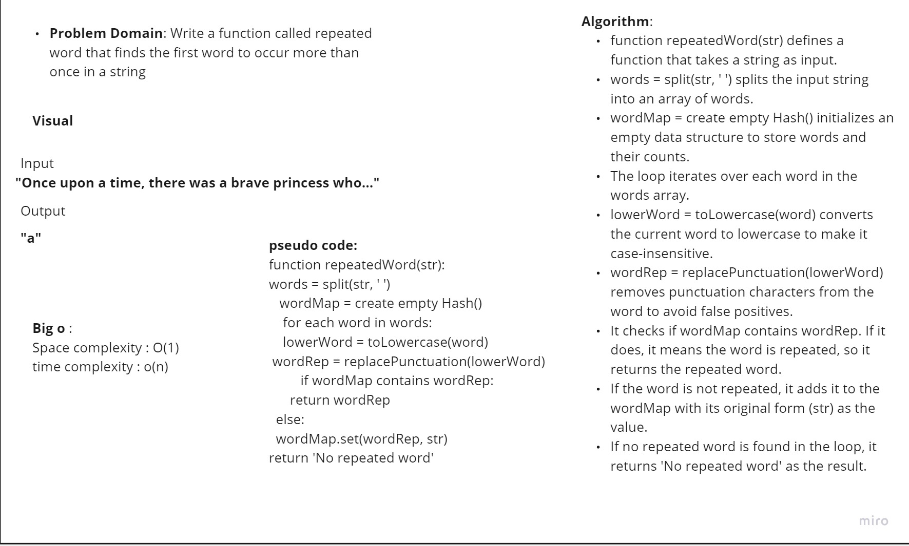

# Hash Table Implementation

## Pull Request:

## whiteBoard:


## Big O:
### Time Complexity: O(n) (linear time complexity)

### Space Complexity: O(1) 

### Approach
The code splits an input string into words, processes each word to make it case-insensitive and remove punctuation, and checks if any word is repeated using a hash map. If a repeated word is found, it is returned; otherwise, 'No repeated word' is returned. The time complexity is O(n), where n is the length of the input string, and the space complexity depends on the number of unique words but can be as high as O(n) in the worst case.

### Code
```javascript
'use strict';


const Hash = require('../Hash')

function repeatedWord(str) {
    const words = str.split(' ');
    const wordMap = new Hash();
    for (const word of words) {
        const lowerWord = word.toLowerCase();
        const wordRep = lowerWord.replace(/[.,!?]/g, '');
        if (wordMap.has(wordRep)) {
            return wordRep;
        } else {
            wordMap.set(wordRep, str);
        }
    }

    return 'No repeated word';
}

const input = "It was a queer, sultry summer, the summer they electrocuted the Rosenbergs, and I didn’t know what I was doing in New York..."
const repeated = repeatedWord(input);
console.log(repeated);
