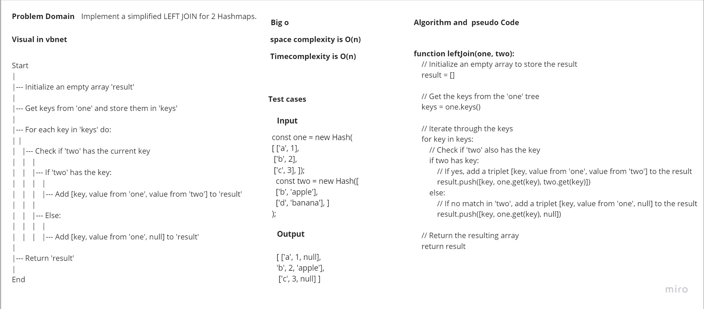

# Implement a simplified LEFT JOIN for 2 Hashmaps.


## Pull Request:

## Big O:
### Time Complexity:
O(n) 

### Space Complexity:
O(n) 

### Approach
The leftJoin function takes two Maps as input, iterates through keys in the first Map, and constructs an array of arrays where each inner array contains a key from the first Map, its corresponding value from the first Map, and its corresponding value from the second Map (or null if not found in the second Map).

### Efficiency
The leftJoin function has a time complexity of O(n), where n is the number of keys in the first Map, and a space complexity of O(n) because it creates a result array containing n elements. This is efficient for small to moderately sized Maps, but it may become inefficient for very large Maps due to the linear time complexity.


## whiteboard: 


### Code

```javascript
'use strict';

function leftJoin(one, two) {
  let result = [];

  const keys = one.keys();

  for (let key of keys) {
    if (two.has(key)) {
      result.push([key, one.get(key), two.get(key)]); 
    }else {
        result.push([key, one.get(key), null]); 

    }
  }

  return result;
}  