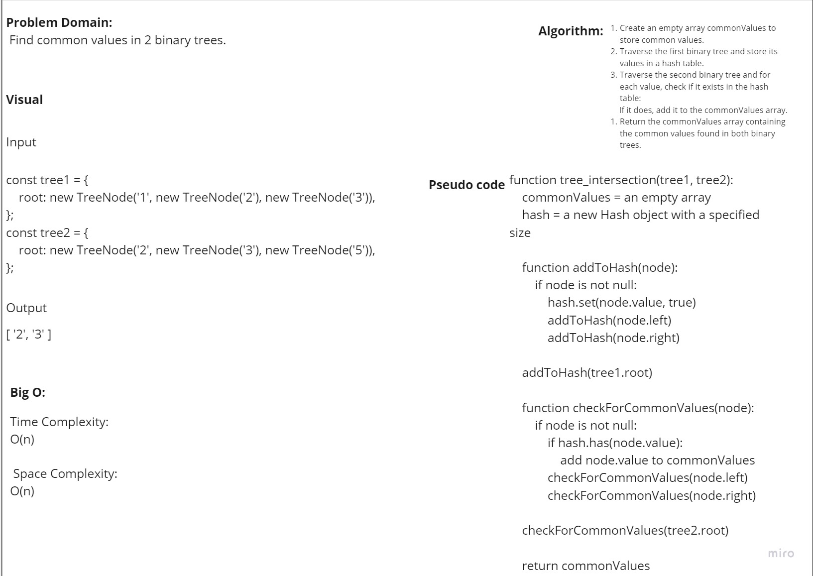

# Find common values in 2 binary trees.


## Pull Request: https://github.com/Hamzamt99/data-structures-and-algorithms/pull/29

## Big O:
### Time Complexity:
O(n) represents the time complexity of building the hash table based on the number of nodes in the first binary tree (n).

### Space Complexity:
O(n) because it depends on the size of the first binary tree.

### Approach
the function uses a hash table to store values from the first binary tree in O(n) time. Then, it traverses the second binary tree, checking for common values in O(m) time, where n and m are the numbers of nodes in the respective trees. Thus, the overall time complexity is O(n + m), and the space complexity is O(n).

### Efficiency
the function  achieves efficient common value detection between two binary trees in O(n + m) time by leveraging a hash table, where n and m are the numbers of nodes in the respective trees, and O(n) space for the hash table.


## whiteboard: 


### Code

```javascript
'use strict';


const Hash = require('../Hash')

function tree_intersection(tree1, tree2) {
    const commonValues = [];

    const hash = new Hash(100);

    function addToHash(node) {
        if (node) {
            hash.set(node.value, true);
            addToHash(node.left);
            addToHash(node.right);
        }
    }

    addToHash(tree1.root);

    function checkForCommonValues(node) {
        if (node) {
            if (hash.has(node.value)) {
                commonValues.push(node.value);
            }
            checkForCommonValues(node.left);
            checkForCommonValues(node.right);
        }
    }

    checkForCommonValues(tree2.root);

    return commonValues;
}


// test the function
class TreeNode {
    constructor(value, left = null, right = null) {
        this.value = value;
        this.left = left;
        this.right = right;
    }
}


const tree1 = {
    root: new TreeNode('1', new TreeNode('2'), new TreeNode('3')),
};

const tree2 = {
    root: new TreeNode('2', new TreeNode('4'), new TreeNode('5')),
};

const commonValues = tree_intersection(tree1, tree2);
console.log("Common Values:", commonValues);

module.exports = TreeNode;
