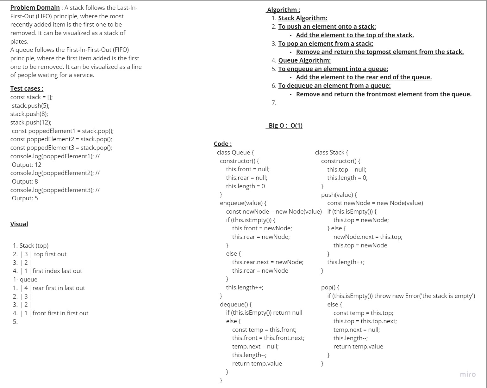

 # Stack and a Queue 
Stack: A stack is a linear data structure that follows the Last-In-First-Out (LIFO) principle, where elements are added and removed from the top.

Queue: A queue is a linear data structure that follows the First-In-First-Out (FIFO) principle, where elements are added at the rear and removed from the front.

## Whiteboard Process

## Approach & Efficiency

### Approach:

- Define the problem and understand the requirements.
- Design an algorithm or choose a suitable data structure (such as stack or queue) to solve the problem.
- Implement the algorithm or use the chosen data structure to manipulate the data and solve the problem.

### Efficiency:
Efficiency refers to optimizing the use of resources in algorithm design and data structure choice.
It is measured by time complexity (how long an algorithm takes to run) and space complexity (memory usage).
Efficient algorithms aim for lower time complexities (e.g., O(1), O(log n)) and data structures for lower space complexities.
Maximizing efficiency leads to improved performance, reduced execution time, and better resource utilization.

### Time complexity:

#### Time complexity is typically expressed using Big O notation, which provides an upper bound on the growth rate of an algorithm's running time:
- O(1): Constant time complexity, where the running time does not depend on the input size.
- O(log n): Logarithmic time complexity, where the running time increases logarithmically with the input size.
- O(n): Linear time complexity, where the running time grows linearly with the input size.
- O(n^2): Quadratic time complexity, where the running time grows quadratically with the input size.

### Space Complexity:

#### Similar to time complexity, space complexity is expressed using Big O notation. Some common space complexity notations include:

- O(1): Constant space complexity, where the space used by the algorithm remains constant regardless of the input size.
- O(n): Linear space complexity, where the space used by the algorithm grows linearly with the input size.
- O(n^2): Quadratic space complexity, where the space used by the algorithm grows quadratically with the input size.

## Solution : 

# stack class class Stack {
    constructor() {
        this.top = null;
        this.length = 0;
    }

    push(value) {
        const newNode = new Node(value)
        if (this.isEmpty()) {
            this.top = newNode;
        } else {
            newNode.next = this.top;
            this.top = newNode
        }
        this.length++;
    }

    pop() {
        if (this.isEmpty()) throw new Error('the stack is empty')
        else {
            const temp = this.top;
            this.top = this.top.next;
            temp.next = null;
            this.length--;
            return temp.value
        }
    }
    peek() {
        if (this.isEmpty()) return null;
        else return this.top.value

    }
    isEmpty() {
        return this.top === null
    }
}

# queue class
class Queue {
    constructor() {
        this.front = null;
        this.rear = null;
        this.length = 0
    }

    enqueue(value) {
        const newNode = new Node(value)
        if (this.isEmpty()) {
            this.front = newNode;
            this.rear = newNode;
        }
        else {
            this.rear.next = newNode;
            this.rear = newNode
        }
        this.length++;
    }
    dequeue() {
        if (this.isEmpty()) return null
        else {
            const temp = this.front;
            this.front = this.front.next;
            temp.next = null;
            this.length--;
            return temp.value
        }
    }
    peek() {
        if (this.isEmpty()) return null
        return this.rear.value;
    }
    isEmpty() {
        return this.front === null;
    }

}
