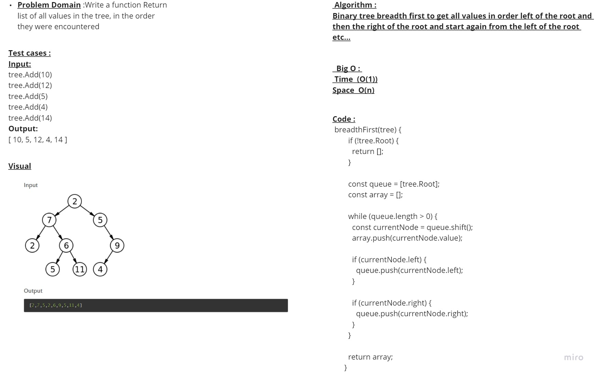

# Challenge Title 
## tree-breadth-first

## whiteboard:

## Approach & Efficiency:
i Used a method to get all roots in the tree which is taking the root and its left and push it and then the root right and push it and start again from root left and the same approach until there are no children and the time complixety for it is o(1) and space is o(n) and the big O is o(log n)
## Solution:
### Node Class:

'use strict'
  breadthFirst(tree) {
        if (!tree.Root) {
          return [];
        }
      
        const queue = [tree.Root];
        const array = [];
      
        while (queue.length > 0) {
          const currentNode = queue.shift();
          array.push(currentNode.value);
      
          if (currentNode.left) {
            queue.push(currentNode.left);
          }
      
          if (currentNode.right) {
            queue.push(currentNode.right);
          }
        }
      
        return array;
      }

