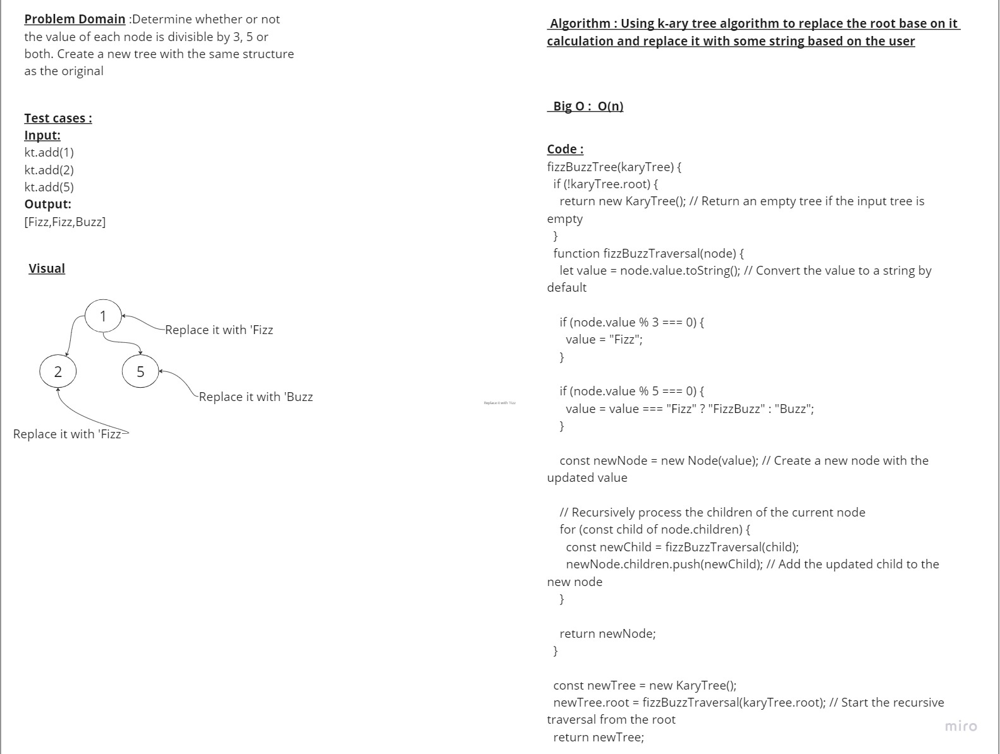

# Challenge Title 
## FizzBuzz k-ary tree

## whiteboard:

## Approach & Efficiency:
i Used a function to loop through all roots and when condition is true based on specific  mathematic it will replace it with a string based on the condition math and the time and space complexity for it is o(n)
## Solution:
### Node Class:

'use strict'
  function fizzBuzzTree(karyTree) {
  if (!karyTree.root) {
    return new KaryTree(); // Return an empty tree if the input tree is empty
  }

  function fizzBuzzTraversal(node) {
    let value = node.value.toString(); // Convert the value to a string by default

    if (node.value % 3 === 0) {
      value = "Fizz";
    }

    if (node.value % 5 === 0) {
      value = value === "Fizz" ? "FizzBuzz" : "Buzz";
    }

    const newNode = new Node(value); // Create a new node with the updated value

    // Recursively process the children of the current node
    for (const child of node.children) {
      const newChild = fizzBuzzTraversal(child);
      newNode.children.push(newChild); // Add the updated child to the new node
    }

    return newNode;
  }

  const newTree = new KaryTree();
  newTree.root = fizzBuzzTraversal(karyTree.root); // Start the recursive traversal from the root
  return newTree;
  }