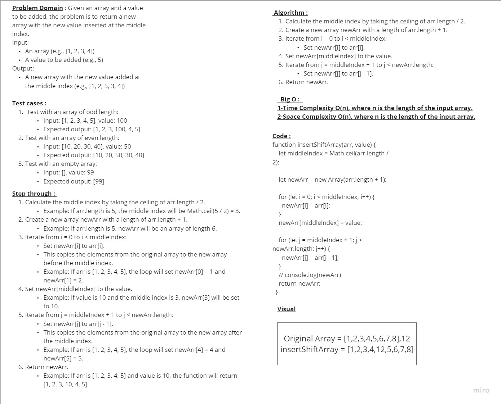

# Challenge Title
function called insertShiftArray which takes in an array and a value to be added. Without utilizing any of the built-in methods, return an array with the new value added at the middle index.

## Whiteboard Process

## Approach & Efficiency
### The approach : The main focus of this code seems to be modifying the array by replacing the value at the middle index. The iteration loop is commented out and not performing any operation, so it doesn't have any effect on the functionality of the code.
### Efficiency Time Complexity: The time complexity is O(n), where n is the length of the input array arr. This is due to the for loop that iterates over the array, even though it doesn't perform any operation inside it.
### Space Complexity: The space complexity is O(1) because the code uses a constant amount of extra space, independent of the size of the input array.
### Overall Efficiency: The code could be considered suboptimal in terms of time efficiency since it includes a loop that doesn't perform any meaningful operation. Removing the unnecessary loop would improve the time efficiency of the code without affecting the functionality.

### Time complexity : 
we can break it down into individual operations and calculate the number of operations performed based on the input size.
Calculating the middle index: The line let middle = Math.floor(arr.length / 2); involves a single division operation (arr.length / 2) and a floor function call (Math.floor). Both of these operations typically have constant time complexity, so we can consider it as O(1).

### Space complexity : 
we need to consider the additional space used by the function as the input size increases.
Variables: The function uses a few variables, such as middle to store the middle index. These variables have constant space requirements and do not depend on the input size. Therefore, their contribution to the space complexity is considered O(1).

## Solution
function insertShiftArray(arr, value) {

    let middleIndex = Math.ceil(arr.length / 2);
  
    let newArr = new Array(arr.length + 1);
  
    for (let i = 0; i < middleIndex; i++) {
      newArr[i] = arr[i];
    }
    newArr[middleIndex] = value;
  
    for (let j = middleIndex + 1; j < newArr.length; j++) {
      newArr[j] = arr[j - 1];
    }
    // console.log(newArr)
    return newArr;
  }

