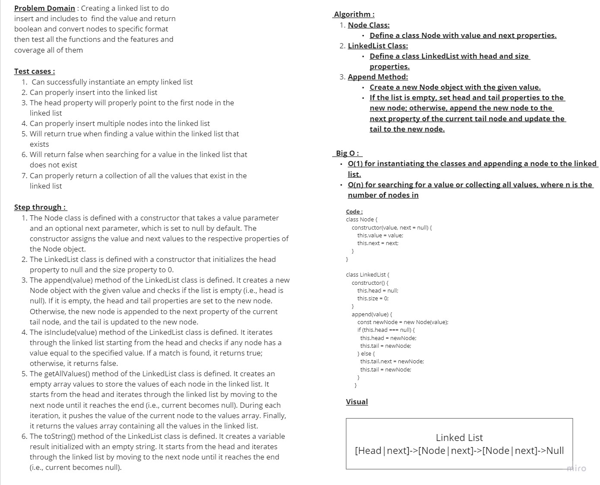
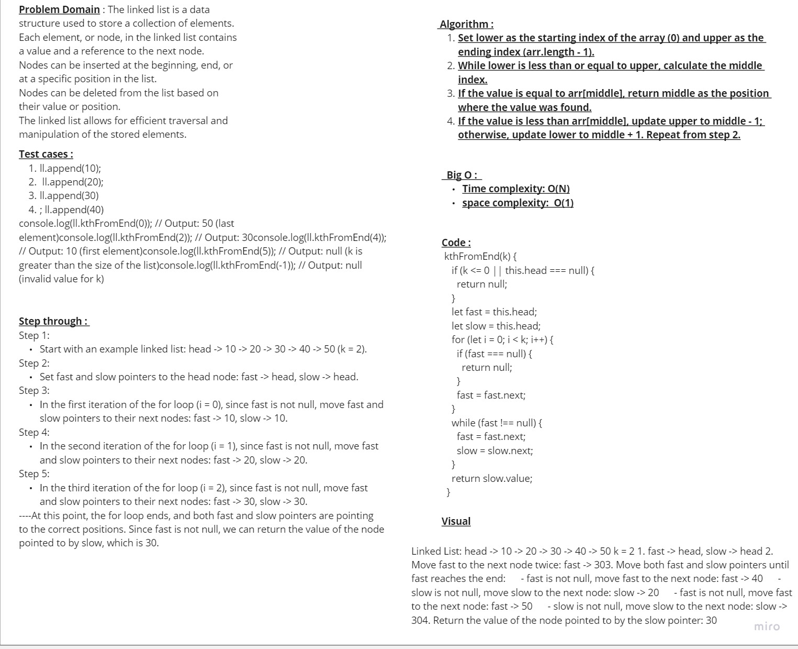

 # Linked List Implementation
Create a Node class that has properties for the value stored in the Node, and a pointer to the next Node.

## Whiteboard Process

## diagram for k-th value from the end of a linked list.

## Approach & Efficiency

### Approach:

- The code implements a singly linked list data structure using the classes Node and LinkedList.
- The Node class represents a single node in the linked list, containing a value and a reference to the next node.
- The LinkedList class represents the linked list, maintaining a reference to the head node and providing methods for various operations.

### Efficiency:

### Time complexity And Space complexity :
- The append operation in the linked list has a time complexity of O(1) as it adds a new node at the end of the list in constant time.
- The prepend operation has a time complexity of O(1) as it adds a new node at the beginning of the list in constant time.
- The search operation has a time complexity of O(n) in the worst case as it may need to traverse the entire list to find the desired value.
- The getAt operation has a time complexity of O(n) as it may require traversing the list until reaching the desired position.
- The isEmpty operation has a time complexity of O(1) as it checks whether the head property is null.
The space complexity of a singly linked list is O(n) as it requires memory to store each node, where n is the number of nodes in the list.

## Solution : 

'use strict';

class Node {
    constructor(value, next = null) {
        this.value = value;
        this.next = next;
    }

}

class LinkedList {
    constructor() {
        this.head = null;
        this.size = 0;
    }
    //append to end of the list
    appendToEnd(value) {
      const newNode = new Node(value);
      if (this.head === null) {
        // If the list is empty, set the new node as both the head and tail
        this.head = newNode;
        this.tail = newNode;
      } else {
        // If the list is not empty, set the next pointer of the current tail to the new node
        // and update the tail to point to the new node
        this.tail.next = newNode;
        this.tail = newNode;
      }
    }
    //append
    append(value) {
        const newNode = new Node(value);
        if (this.head === null) {
          this.head = newNode;
          this.tail = newNode;
        } else {
          this.tail.next = newNode;
          this.tail = newNode;
        }
      }

    // isInclude
    isInclude(value) {
        let current = this.head;

        while (current !== null) {
            if (current.value === value) {
                return true;
            }
            current = current.next;
        }

        return false;
    }
    // printAllList
    getAllValues() {
        const values = [];
        let current = this.head;
    
        while (current !== null) {
          values.push(current.value);
          current = current.next;
        }
    
        return values;
      }
      //adds a new node with the given new value immediately before the first node that has the value specified
      insertBefore(value, newValue) {
        const newNode = new Node(newValue);
      
        // Case 1: If the list is empty, there is nothing to insert before
        if (this.head === null) {
          return;
        }
      
        // Case 2: If the node to be inserted before is the head node
        if (this.head.value === value) {
          newNode.next = this.head;
          this.head = newNode;
          this.size++;
          return;
        }
      
        let current = this.head;
        let previous = null;
      
        // Traverse the list to find the node with the specified value
        while (current !== null && current.value !== value) {
          previous = current;
          current = current.next;
        }
      
        // Case 3: If the specified value was not found in the list
        if (current === null) {
          return;
        }
      
        // Case 4: Insert the new node before the node with the specified value
        previous.next = newNode;
        newNode.next = current;
        if (current === this.head) {
          this.head = newNode;
        }
        this.size++;
      }
      
      insertAfter(value, newValue) {
        const newNode = new Node(newValue);
      
        let current = this.head;
      
        // Traverse the list to find the node with the specified value
        while (current !== null && current.value !== value) {
          current = current.next;
        }
      
        // Case 1: If the specified value was not found in the list
        if (current === null) {
          return;
        }
      
        // Case 2: Insert the new node after the node with the specified value
        newNode.next = current.next;
        current.next = newNode;
      
        // Update the tail reference if the new node is inserted at the end
        if (current === this.tail) {
          this.tail = newNode;
        }
      
        this.size++;
      }
      
    // convert the node to this format node -> node -> null
    toString() {
        let current = this.head;
        let result = '';

        while (current !== null) {
            result += `{ ${current.value} } -> `;
            current = current.next;
        }

        result += 'NULL';
        return result;
    }

}
const ll = new LinkedList();
ll.append(100)
ll.append(200)
ll.append('a')
ll.getAllValues();
let test = ll.isInclude('a')
// console.log(test)
// console.log(ll.toString())

module.exports = LinkedList;