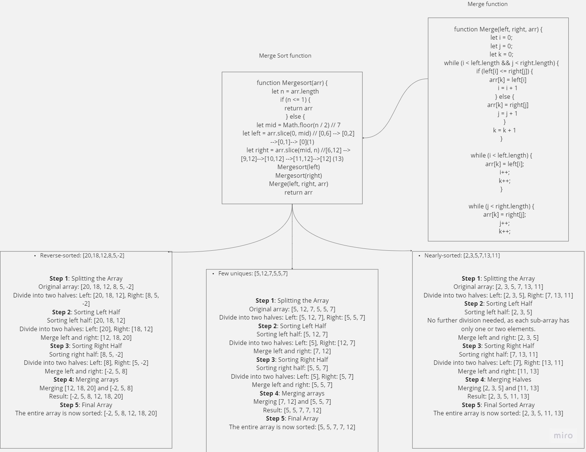

# Merge Sort Algorithm Explanation

## Whiteboard Illustration



## Approach

1. **Split the array into two halves**: Left and Right.
2. **Recursively sort and merge** the left and right halves.
3. **Merge the sorted halves back together**.

## Efficiency

- **Time Complexity**: Merge Sort has a time complexity of O(n log n), making it efficient for large datasets.
- **Consistent Performance**: Its consistent performance makes it suitable for various scenarios.
- **Memory Usage**: Merge Sort uses additional memory space due to its divide-and-conquer approach.

## Pseudocode

```javascript
'use strict';

function mergeSort(arr) {
    let n = arr.length;
    if (n <= 1) {
        return arr;
    } else {
        let mid = Math.floor(n / 2);
        let left = arr.slice(0, mid);
        let right = arr.slice(mid);
        mergeSort(left);
        mergeSort(right);
        merge(left, right, arr);
        return arr;
    }
}

function merge(left, right, arr) {
    let i = 0;
    let j = 0;
    let k = 0;
    
    while (i < left.length && j < right.length) {
        if (left[i] <= right[j]) {
            arr[k] = left[i];
            i++;
        } else {
            arr[k] = right[j];
            j++;
        }
        k++;
    }

    while (i < left.length) {
        arr[k] = left[i];
        i++;
        k++;
    }

    while (j < right.length) {
        arr[k] = right[j];
        j++;
        k++;
    }
}
