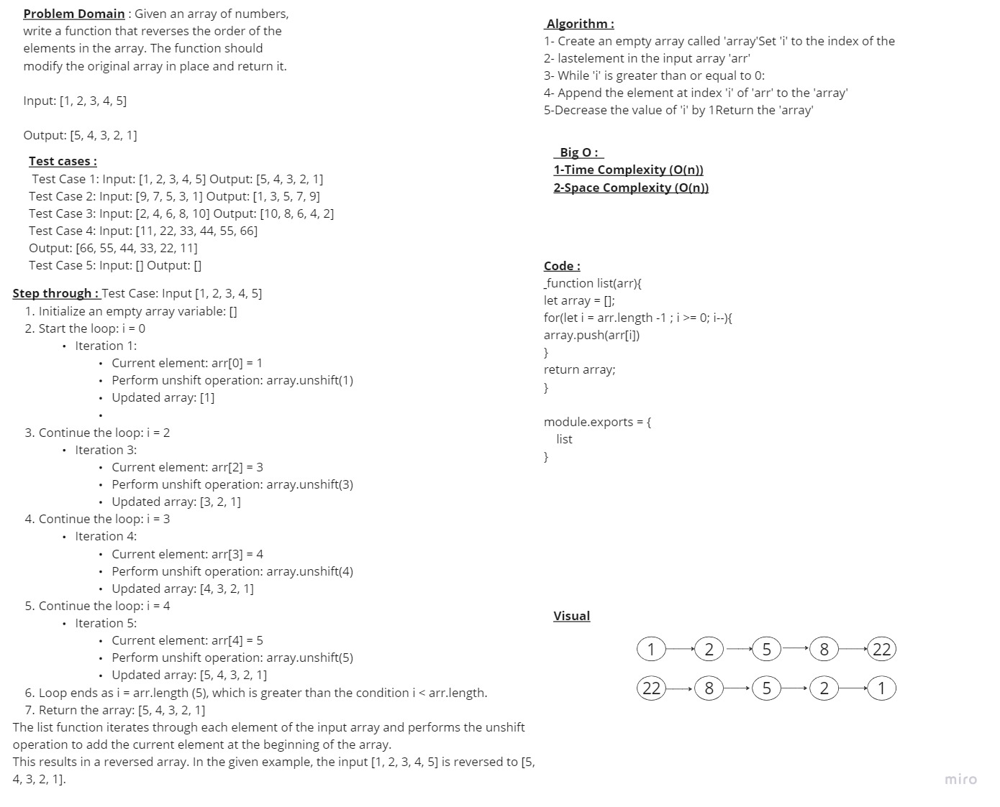

# Challenge Title
function reverseArray which takes an array as an argument. Without utilizing any of the built-in methods, return an array with elements in reversed order.

## Whiteboard Process

## Approach & Efficiency
### The approach taken by the list function to reverse an array is straightforward and involves iterating through the input array and adding each element at the beginning of a new array using the unshift operation 
### Efficiency is a crucial consideration when designing algorithms and writing code. It refers to how well an algorithm performs in terms of time and space requirements.

## Solution
function list(arr){
let array = [];
for(let i = arr.length -1 ; i >= 0; i--){
array.push(arr[i])
}
return array;
}

