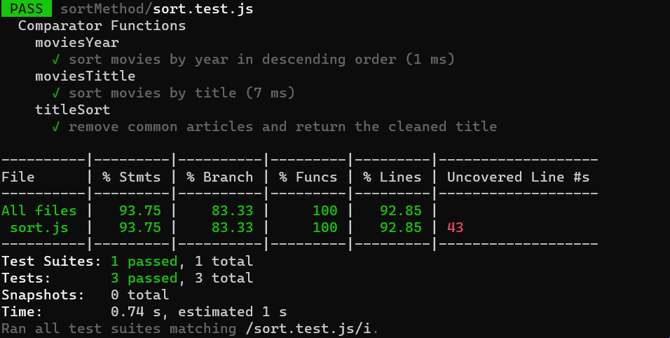

# Sort Method

## pull request: https://github.com/Hamzamt99/data-structures-and-algorithms/pull/25

## Test Image



## Code

```javascript
'use strict'
const movies = [
    {
        title: 'The Inception',
        year: 2010,
        genres: ['Science Fiction', 'Action', 'Thriller']
    },
    {
        title: 'The Shawshank Redemption',
        year: 1994,
        genres: ['Drama']
    },
    {
        title: 'Jurassic Park',
        year: 1993,
        genres: ['Science Fiction', 'Adventure']
    },
    {
        title: 'Pulp Fiction',
        year: 1994,
        genres: ['Crime', 'Drama']
    },
    {
        title: 'The Lord of the Rings: The Fellowship of the Ring',
        year: 2001,
        genres: ['Fantasy', 'Adventure']
    }
];

function moviesYear(a, b) {
    return b.year - a.year;
}

function moviesTittle(a, b) {
    const A = titleSort(a.title);
    const B = titleSort(b.title);
    if (A < B) return -1;
    else if (A > B) return 1;
    return 0;
}

function titleSort(title) {
    const articles = ['A ', 'a ', 'The ', 'the ', 'An ', 'an '];
    for (const article of articles) {
        if (title.startsWith(article)) {
            title = title.slice(article.length);
            break;
        }
    }
    return title;
}

module.exports = {
    moviesYear,
    moviesTittle,
    titleSort,
}

// Usage:
// movies.sort(moviesYear);
// console.log('Movies sorted by year:', movies);

// movies.sort(moviesTittle);
// console.log('Movies sorted by title:', movies);
