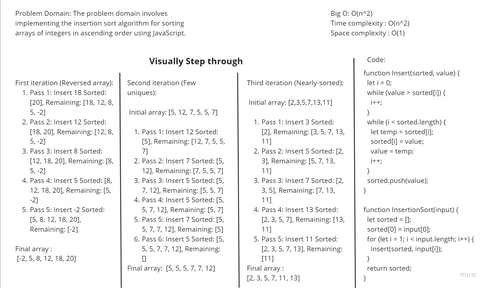

# sort insertion
## pull request: https://github.com/Hamzamt99/data-structures-and-algorithms/pull/22
## WhiteBoard

 

### Approach: Insertion sort works by iteratively building a sorted portion of the array while inserting each element from the unsorted portion into its correct position within the sorted portion.

### Efficiency: In the best-case scenario (nearly-sorted array), insertion sort's time complexity is O(n) since it requires minimal comparisons and swaps.

### code : 

function Insert(sorted, value) {
    let i = 0;
    while (value > sorted[i]) {
      i++;
    }
    while (i < sorted.length) {
      let temp = sorted[i];
      sorted[i] = value;
      value = temp;
      i++;
    }
    sorted.push(value);
  }
  
  function InsertionSort(input) {
    let sorted = [];
    sorted[0] = input[0];
    for (let i = 1; i < input.length; i++) {
      Insert(sorted, input[i]);
    }
    return sorted;
  }
  
