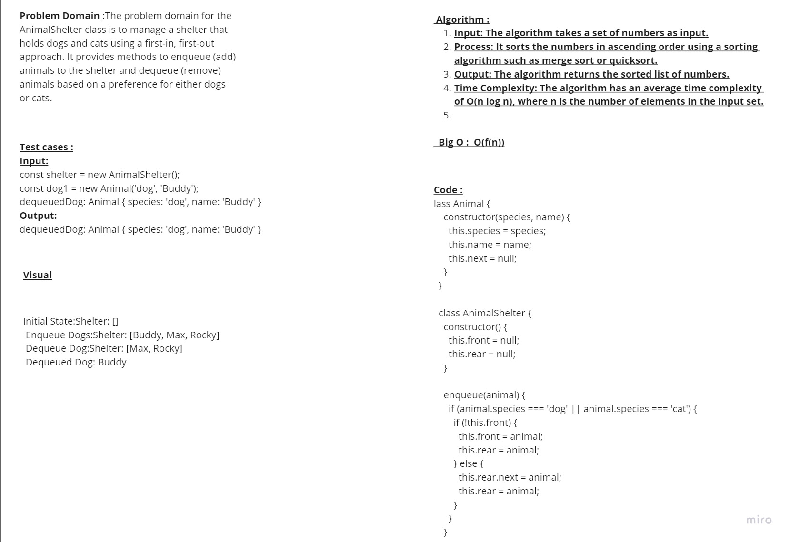

 # Stack and a Queue 
Stack: A stack is a linear data structure that follows the Last-In-First-Out (LIFO) principle, where elements are added and removed from the top.

Queue: A queue is a linear data structure that follows the First-In-First-Out (FIFO) principle, where elements are added at the rear and removed from the front.

## Whiteboard Process

## Approach & Efficiency

### Approach:

- Input: The problem takes a set of data as input.
- Approach: The approach involves iterating through the data and performing specific operations or transformations based on the problem requirements.
- Output: The approach produces the desired result or output by applying the necessary operations or transformations to the input data.

### Efficiency:
Efficiency refers to how effectively resources such as time and space are utilized by an algorithm or system.
It involves optimizing the performance of the solution to achieve the desired outcome with minimal resource consumption.
Efficiency is typically measured through analyzing the algorithm's time complexity (execution time) and space complexity (memory usage) to ensure optimal performance.

### Time complexity:
Time complexity is typically expressed using Big O notation, denoted as O(f(n)), where f(n) represents the upper bound on the growth rate of the algorithm's execution time with respect to the input size n.

### Space Complexity:
Similar to time complexity, space complexity is expressed using Big O notation, denoted as O(f(n)), where f(n) represents the upper bound on the growth rate of the algorithm's space requirement with respect to the input size n.

## Solution : 

class Animal {
    constructor(species, name) {
      this.species = species;
      this.name = name;
      this.next = null;
    }
  }
  
  class AnimalShelter {
    constructor() {
      this.front = null;
      this.rear = null;
    }
  
    enqueue(animal) {
      if (animal.species === 'dog' || animal.species === 'cat') {
        if (!this.front) {
          this.front = animal;
          this.rear = animal;
        } else {
          this.rear.next = animal;
          this.rear = animal;
        }
      }
    }
  
    dequeue(pref) {
      if (pref === 'dog' || pref === 'cat') {
        if (!this.front) {
          return null;
        }
        
        const animal = this.front;
        this.front = this.front.next;
  
        if (!this.front) {
          this.rear = null;
        }
  
        if (animal.species === pref) {
          return animal;
        } else {
          const temp = animal;
          let prev = null;
  
          while (temp && temp.species !== pref) {
            prev = temp;
            temp = temp.next;
          }
  
          if (!temp) {
            return null;
          }
  
          prev.next = temp.next;
  
          if (!prev.next) {
            this.rear = prev;
          }
  
          return temp;
        }
      }
  
      return null;
    }
  }
  