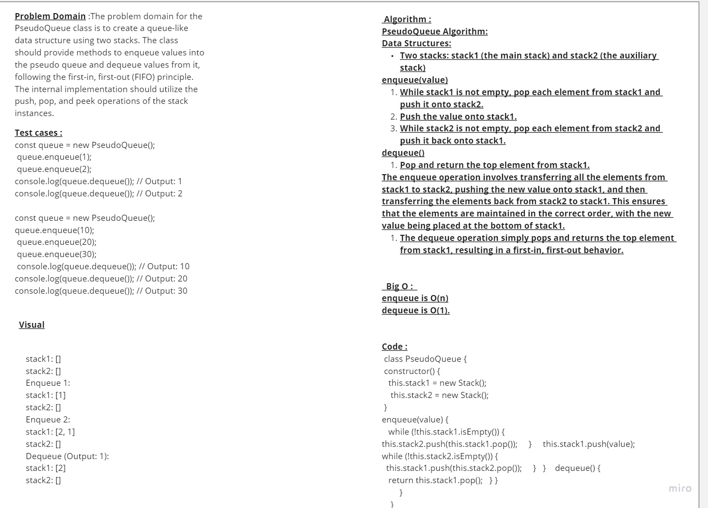

 # stack-queue-pseudo
Stack: A stack is a linear data structure that follows the Last-In-First-Out (LIFO) principle, where elements are added and removed from the top.

Queue: A queue is a linear data structure that follows the First-In-First-Out (FIFO) principle, where elements are added at the rear and removed from the front.

## Whiteboard Process

## Approach & Efficiency

### Approach:

1. For the `enqueue` operation, transfer all elements from `stack1` to `stack2`, push the new value to `stack1`, and transfer elements back from `stack2` to `stack1`.
2. For the `dequeue` operation, simply pop and return the top element from `stack1`.
3. This approach ensures a first-in, first-out behavior for the PseudoQueue using two stacks.

### Efficiency:

The efficiency of the PseudoQueue implementation using two Stack instances can be summarized in three lines:

The enqueue operation has a time complexity of O(n), where n is the number of elements in the PseudoQueue, as it involves transferring elements between the two stacks.
The dequeue operation has a time complexity of O(1) as it directly pops the top element from stack1.
The space complexity of the PseudoQueue implementation is O(n), as it requires additional space to store elements in the two stacks.

### Time complexity:
to stack2, pushing a new element to stack1, and then transferring elements back from stack2 to stack1. The transfer process requires iterating through the elements in one stack and pushing them to the other stack. As a result, the time complexity of the enqueue operation is O(n), where n is the number of elements already in the PseudoQueue.

Dequeue Operation: The dequeue operation only involves popping the top element from stack1. Since accessing the top element of a stack has a time complexity of O(1), the dequeue operation also has a time complexity of O(1).

### Space Complexity:

Stack Space: The two Stack instances, stack1 and stack2, are used internally to create and manage the PseudoQueue. The space occupied by these stacks is directly proportional to the number of elements in the PseudoQueue. Therefore, the space complexity is O(n), where n is the number of elements in the PseudoQueue.

Additional Space: Apart from the stack space, there is no additional space required by the PseudoQueue implementation. The space complexity remains O(n) due to the presence of the stacks, but there are no other significant additional data structures or variables that contribute to the space complexity.

## Solution : 

class Stack {
    constructor() {
        this.items = [];
    }

    push(item) {
        this.items.push(item);
    }

    pop() {
        if (!this.isEmpty()) {
            return this.items.pop();
        }
    }

    peek() {
        if (!this.isEmpty()) {
            return this.items[this.items.length - 1];
        }
    }

    isEmpty() {
        return this.items.length === 0;
    }
}

class PseudoQueue {
    constructor() {
        this.stack1 = new Stack();
        this.stack2 = new Stack();
    }

    enqueue(value) {
        while (!this.stack1.isEmpty()) {
            this.stack2.push(this.stack1.pop());
        }
        this.stack1.push(value);
        while (!this.stack2.isEmpty()) {
            this.stack1.push(this.stack2.pop());
        }
    }

    dequeue() {
        return this.stack1.pop();
    }
}